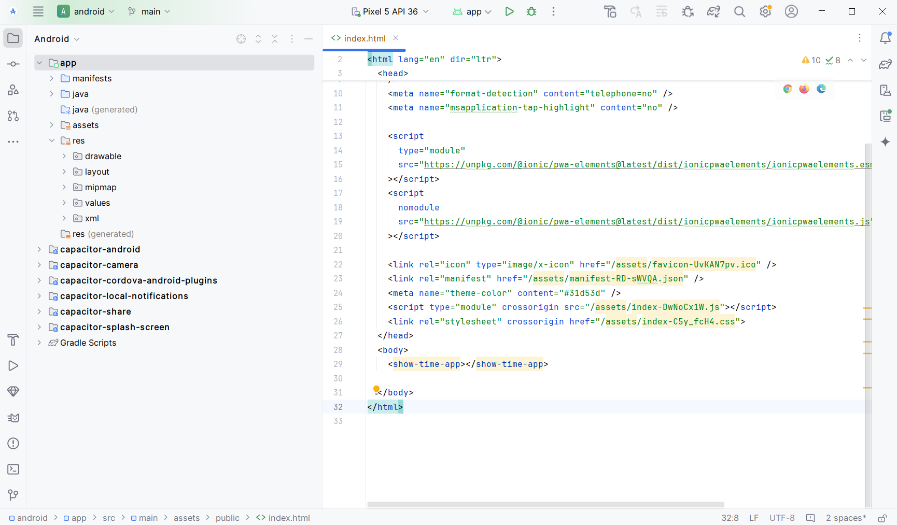
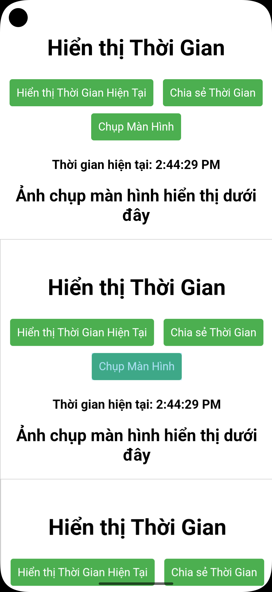

# Nguyễn Văn Tân Phúc
## Hướng dẫn chạy ứng dụng

Mở thư mục android bằng android studio. Sau đó nhấn nút run (hình tam giác màu xanh trên cùng) để chạy ứng dụng

### Chức năng ứng dụng
Hiển thị thời gian hiện tại khi nhấn nút
Thông báo cục bộ hiển thị thời gian hiện tại
Chia sẻ thời gian hiện tại
Chụp màn hình ứng dụng

